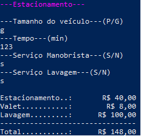

# Estacionamento

Este programa recebe dados de um estacionamento. Sendo pedido:
```
- Tamanho do veículo;
- O tempo do veículo estacionado;
- O serviço de manobrista;
- O serviço de lavagem.
```
## Exemplo
```
---Estacionamento---

---Tamanho do veículo---(P/G)
g
---Tempo---(min)
123
---Serviço Manobrista---(S/N)
s
---Serviço Lavagem---(S/N)
s

Estacionamento..:       R$ 40,00
Valet...........:        R$ 8,00
Lavagem.........:      R$ 100,00
--------------------------------
Total...........:      R$ 148,00
```

## Screenshot



## Download

Baixe o arquivo abaixo. Descompacte na pasta desejada.

[🔗 Download do arquivo .zip](dist/Estacionamento.zip)

Execute utilizando o comando:

```
dotnet estacionamento.dll
```

## Agradecimentos

- [Etec Adolpho Berezin](https://etecab.cps.sp.gov.br/)
- [Karine Maria da Silva](https://github.com/karine901)
- [Karina Barbosa de Almeida](https://github.com/KarinaAlmeid4)
